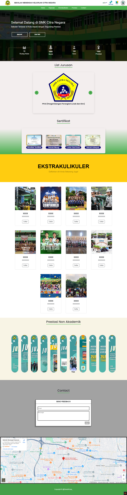
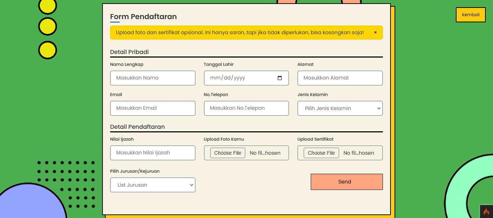
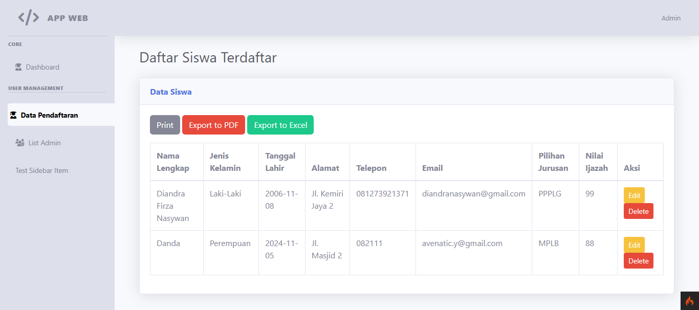

# PPDB Website - SMK Citra Negara 🎓



**PPDB Website** ini adalah sebuah platform pendaftaran siswa baru berbasis web yang dirancang untuk SMK Citra Negara. Dibuat menggunakan **CodeIgniter 4**, proyek ini menampilkan desain responsif, aesthetic, family friendly, fitur informatif, dan pengalaman pengguna yang intuitif.

## TIM:
- **FIGMA         = RODIN, CALISTA**
- **WRITE FRAME   = RASYID**
- **SLASHING      = RIVALDO, MAGFI**
- **PRESENTASI    = AMAR, RUBEN**
---

## ✨ Fitur Utama

-   **Landing Page Menarik**: Menampilkan informasi sekolah, jurusan, ekstrakurikuler, dan prestasi.
-   **Form Pendaftaran Online**: Proses pendaftaran siswa baru yang mudah dan efisien.
-   **Dashboard Admin**: Mengelola siswa yang daftar, guru, admin, ekstrakuliler, dll.
-   **Sistem Feedback**: Pengguna dapat memberikan feedback langsung melalui form.

---

## 📸 Demo

-   **Halaman Utama**  
    

-   **Halaman PPDB**  
    

-   **Halaman Dashboard Admin**  
    

---

## 🛠️ Teknologi yang Digunakan

-   **Frontend**: HTML5, CSS3, JavaScript (Bootstrap)
-   **Backend**: CodeIgniter 4
-   **Database**: MySQL

---

## ⚙️ Cara Menjalankan Project

1. Clone repositori ini:
    ```bash
    git clone https://github.com/DiandraFrza/PPDBCitraNegara.git
    ```
2. Masuk ke direktori proyek:
    ```bash
    cd repository-name
    ```
3. Install dependensi menggunakan Composer:
    ```bash
    composer install
    ```
4. Konfigurasi file `.env` untuk database:
    ```env
    database.default.hostname = localhost
    database.default.database = pppdb_smkcitranegara
    database.default.username = root
    database.default.password =
    database.default.DBDriver = MySQLi
    ```
5. Jalankan server lokal:
    ```bash
    php spark serve
    ```
6. Akses website di browser:
    ```
    http://localhost:8080
    ```

---

## 💡 Tentang Proyek

Proyek ini bertujuan untuk memudahkan proses pendaftaran siswa baru di SMK Citra Negara sekaligus memperkenalkan informasi sekolah dengan desain modern dan interaktif.

---

## 📞 Kontak

Untuk pertanyaan lebih lanjut, hubungi:  
📧 Email: diandranasywan@gmail.com
